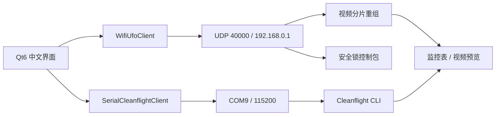

# 设计说明

## 总体架构

## 界面分区

- 顶部连接栏：协议、IP、UDP 端口、串口、波特率、连接按钮。
- 左侧：视频预览和运行日志。
- 右侧监控页：遥测表格。
- 右侧控制页：安全锁、四通道滑条、启动/停止控制流、起飞/降落/急停。
- 右侧飞控 CLI 页：Cleanflight 命令行交互。
- 右侧安全页：使用流程和硬件识别结果。

## 安全策略

- 默认锁定飞行动作。
- 未勾选安全锁时，控制流、起飞、降落、急停都会被拦截。
- 起飞、降落、急停有二次确认弹窗。
- 急停按钮标红，并在代码中单独处理。
- 控制流周期为 50 ms；停止控制流不会关闭监控 UDP，可继续看视频。

## 数据路径

- 工程：`E:\AI_project\slam\qt_ground_station`
- Qt 上位机日志：`E:\AI_project\slam\runtime\qt_logs`
- Python 原型日志：`E:\AI_project\slam\runtime\logs`
- 不主动在 C 盘创建项目脚本、构建缓存或日志。

## 后续扩展

- 增加视频录像和截图。
- 增加 MSP 二进制协议读取姿态、电池、通道值。
- 增加遥控器输入映射，例如手柄或键盘。
- 增加参数备份：自动执行 `version/status/dump` 并保存。
- 增加飞行前检查：电压、串口在线、WiFi 包率、油门归零、安全锁状态。

